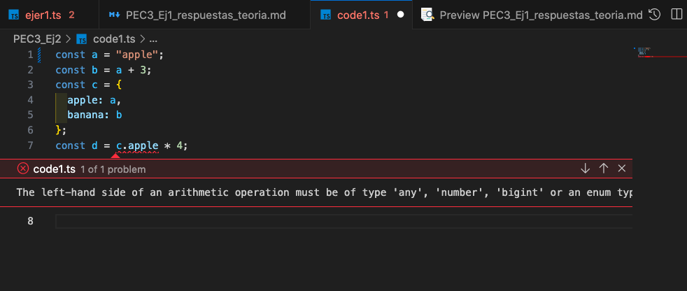

### Modifica el codi per aconseguir que aparegui una línia vermella d'error a l'IDE avisant-te que s'està disparant un TypeError. Explica per què s'ha produït això i quins avantatges té.

#### Explicació:
Hem modificat la variable `a` perquè sigui un string en comptes d'un number.

Ara `b` és el resultat de concatenar un string amb el valor enter 3. Això fa que ara `b` sigui també un string, amb el valor "apple3".

L’objecte `c` té dues propietats (apple i banana), totes dues de tipus string seguint la nostra modificació.

Quan s'intenta fer el càlcul de c.apple * 4, TypeScript detecta un problema perquè c.apple és un string (amb el valor "apple") i no es pot multiplicar per un enter 4. Això genera un TypeError en temps de compilació, indicat amb una línia vermella, i es mostra a l'IDE com:



---

### Contesta les qüestions següents:

#### 1. Per a cadascun dels valors del fitxer code2.ts, quin tipus de dades inferirà TypeScript? Expliqueu per què s'ha inferit aquest tipus de dades.

`a` s'inferirà com a tipus `number` perquè 1042 és un valor numèric enter.

`b` s'inferirà com a tipus `string` perquè s'ha definit el valor assignat entre '' per definir una cadena de caràcters a partir d'un conjunt de paraules separades per espai.

`c` s'inferirà com a `string` perquè de la mateixa manera que b s'ha usat '' per definir una cadena de caràcters format per una paraula.

`d` s'inferirà com a `boolean[]` perquè s'ha assignat un array de valors true o false a cada posició d'un array de length = 3.

`e` s'inferirà com a tipus `{ type: string }`. perquè s'ha assignat un element de tipus object creat amb `{}`amb un sol camp de tipus string.

`f` s'inferirà com un array de tipus number | boolean `(number | boolean)[]` perquè conté elements de tipus number i boolean. 

`g` s'inferirà com a tipus `number[]` perquè s'ha assignat un array d'una sola posició amb un valor enter de 3

`h` s'inferirà com a tipus `null` o `any` perquè se li assigna un valor usant la paraula reservada null. 

#### 2.  Per què es dispara cadascun dels errors del fitxer code3.ts?

1. L'error **TS2588** en TypeScript es produeix quan a la línia 2 intentem modificar el valor d'una variable declarada com a `const`. Aquest error apareix perquè les constants no es poden reassignar després d'haver-se declarat i inicialitzat.

2. L'error **TS2345** es produeix perquè s'intenta fer push d'un valor de tipus `string` dins un array definit inicialment per valors de tipus number.

3. L'error **TSTS2322** es produeix perquè quan es declara una variable amb el tipus never, s'està indicant que aquesta variable no hauria de contenir cap valor assignable. En el moment que s'intenta asignar el valor de tipus `number` salta l'error.

4. L'error TS2571 es produeix perquè TypeScript no permet realitzar operacions directament amb variables de tipus unknown sense abans comprovar el seu tipus com ara això:
```css
    if (typeof l === 'number') {
        let m = l * 2;
    }
```


#### 3.  Quina és la diferència entre una classe i una interfície a TypeScript?

En TypeScript, de manera general, podem dir que una classe és com un plànol de com hauria de ser un objecte i com s'ha de comportar, mentre que una interfície és una estructura utilitzada exclusivament per a la verificació de tipus. Una classe permet generar instàncies d'objectes, mentre que una interfície no.

Una classe pot tenir propietats inicialitzades, mètodes i funcions. En canvi, una interfície defineix únicament les propietats i el tipus que pot tenir un objecte, però no conté cap implementació de mètodes.


---
